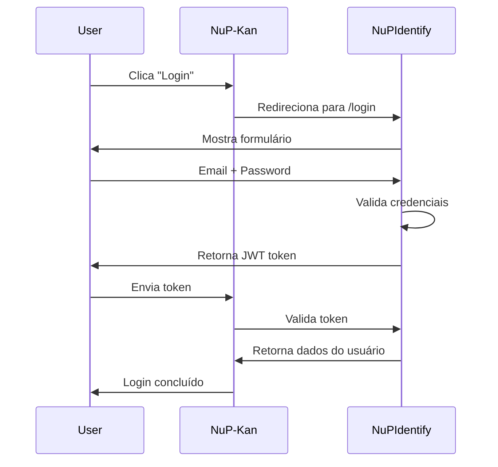

# 🔗 Guia de Integração NuP-Kan ↔ NuPIdentify

Este guia explica como o NuP-Kan se integra com o NuPIdentify para autenticação e gerenciamento de permissões centralizado.

## 📋 Índice

1. [Visão Geral](#visão-geral)
2. [Configuração Inicial](#configuração-inicial)
3. [Sincronização de Permissões](#sincronização-de-permissões)
4. [Autenticação de Usuários](#autenticação-de-usuários)
5. [Validação de Permissões](#validação-de-permissões)
6. [Exemplos de Código](#exemplos-de-código)
7. [Troubleshooting](#troubleshooting)

---

## 🎯 Visão Geral

### Arquitetura

```
┌─────────────────┐         ┌──────────────────┐
│   NuP-Kan       │         │   NuPIdentify    │
│   (Port 5000)   │ ◄─────► │   (Port 3001)    │
│                 │         │                  │
│  - Kanban App   │         │  - Auth Server   │
│  - permissions  │  sync   │  - Permission DB │
│    .json        │ ──────► │  - User Mgmt     │
└─────────────────┘         └──────────────────┘
        │                            │
        └──────────► PostgreSQL (Separate DBs)
```

### Fluxo de Integração

1. **Sincronização** (automática a cada 5 min)
   - NuP-Kan → envia `permissions.json` → NuPIdentify
   - NuPIdentify registra/atualiza permissões do sistema

2. **Autenticação** (quando usuário faz login)
   - Usuário → login no NuPIdentify → recebe JWT token
   - NuP-Kan valida token via API do NuPIdentify

3. **Autorização** (em cada requisição protegida)
   - NuP-Kan → verifica permissão do usuário → via API NuPIdentify
   - Cache de 5 minutos para otimização

---

## ⚙️ Configuração Inicial

### 1. Variáveis de Ambiente

Crie um arquivo `.env` baseado no `.env.example`:

```bash
# NuPIdentify Integration
IDENTITY_URL=https://nupidentify.replit.dev
IDENTITY_SYNC_TOKEN=<seu-token-jwt-admin>

# Sync Configuration
AUTO_SYNC_PERMISSIONS=true
SYNC_INTERVAL_MINUTES=5
```

### 2. Obter Token de Admin

No projeto **NuPIdentify**, faça login com usuário admin e copie o JWT token:

```bash
# Login no NuPIdentify
curl -X POST https://nupidentify.replit.dev/api/auth/login \
  -H "Content-Type: application/json" \
  -d '{
    "email": "admin@nuptechs.com",
    "password": "sua-senha"
  }'

# Copie o "token" retornado e cole em IDENTITY_SYNC_TOKEN
```

### 3. Verificar Conectividade

```bash
# Testar conexão com NuPIdentify
curl https://nupidentify.replit.dev/health
```

---

## 🔄 Sincronização de Permissões

### Arquivo `permissions.json`

Defina todas as funcionalidades do NuP-Kan:

```json
{
  "system": {
    "id": "nup-kan",
    "name": "NuP-Kan - Sistema Kanban",
    "description": "Sistema de gerenciamento de projetos com quadros Kanban",
    "version": "1.0.0",
    "apiUrl": "https://nupkan.replit.dev"
  },
  "functions": [
    {
      "key": "tasks-list",
      "name": "Listar Tasks",
      "category": "Tasks",
      "description": "Permitir listar tasks",
      "endpoint": "GET /api/tasks"
    },
    {
      "key": "tasks-create",
      "name": "Criar Tasks",
      "category": "Tasks",
      "description": "Permitir criar tasks",
      "endpoint": "POST /api/tasks"
    }
  ]
}
```

### Sincronização Automática

O serviço de sincronização inicia automaticamente quando o servidor NuP-Kan sobe:

```typescript
// server/index.ts
import { getIdentitySyncService } from "./identitySyncService";

// Inicia sincronização automática
const syncService = getIdentitySyncService();
await syncService.start();
```

**Características:**
- ✅ Sincronização na inicialização
- ✅ Sincronização periódica (intervalo configurável)
- ✅ Retry automático (3 tentativas)
- ✅ Detecção de mudanças (hash-based)
- ✅ Logs detalhados

### Sincronização Manual

```bash
# Sincronizar manualmente
npm run sync:permissions

# Verificar número de permissões no arquivo
npm run sync:check
```

### Script Standalone

Use o script da pasta `examples/` em outros projetos:

```bash
export IDENTITY_URL="https://nupidentify.replit.dev"
export IDENTITY_ADMIN_TOKEN="seu-token-jwt"
node examples/sync-permissions.js
```

---

## 🔐 Autenticação de Usuários

### Fluxo de Login



### Implementação

```typescript
// Middleware de autenticação
import { authenticate } from './examples/middleware-auth';

app.get('/api/tasks', authenticate, async (req, res) => {
  // req.user contém dados do usuário autenticado
  const tasks = await getTasks(req.user.id);
  res.json(tasks);
});
```

---

## 🛡️ Validação de Permissões

### Middleware de Autorização

```typescript
import { authorize } from './examples/middleware-auth';

// Proteger rota com permissão específica
app.post('/api/tasks', 
  authenticate,
  authorize('tasks-create'),
  async (req, res) => {
    // Usuário tem permissão 'tasks-create'
    const task = await createTask(req.body);
    res.json(task);
  }
);
```

### Com Cache (Recomendado)

```typescript
import { authorizeCached } from './examples/middleware-auth';

// Usa cache de 5 minutos para melhor performance
app.get('/api/tasks', 
  authenticate,
  authorizeCached('tasks-list'),
  async (req, res) => {
    const tasks = await getTasks();
    res.json(tasks);
  }
);
```

### Limpar Cache

```typescript
import { clearPermissionCache } from './examples/middleware-auth';

// Limpar cache quando permissões do usuário mudarem
app.post('/api/users/:id/permissions', async (req, res) => {
  await updateUserPermissions(req.params.id, req.body);
  clearPermissionCache(req.params.id);
  res.json({ success: true });
});
```

---

## 💻 Exemplos de Código

### 1. API Express Completa

Veja `examples/express-integration.js` para um exemplo completo de:
- Setup do Express
- Middlewares de autenticação
- Rotas protegidas
- Validação de permissões
- Tratamento de erros

### 2. Middleware Customizado

Veja `examples/middleware-auth.js` para:
- Função `authenticate()`
- Função `authorize(functionKey)`
- Função `authorizeCached()` com cache
- Sistema de cache com TTL

### 3. Script de Sincronização

Veja `examples/sync-permissions.js` para:
- Leitura do `permissions.json`
- Validação de estrutura
- Envio para NuPIdentify
- Tratamento de erros

---

## 🐛 Troubleshooting

### Problema: "IDENTITY_SYNC_TOKEN não configurado"

**Solução:**
```bash
# 1. Faça login no NuPIdentify como admin
# 2. Copie o token JWT retornado
# 3. Configure a variável de ambiente
export IDENTITY_SYNC_TOKEN="seu-token-aqui"
```

### Problema: "Erro ao conectar com NuPIdentify"

**Verificações:**
```bash
# 1. NuPIdentify está rodando?
curl https://nupidentify.replit.dev/health

# 2. URL está correta?
echo $IDENTITY_URL

# 3. Token é válido?
curl https://nupidentify.replit.dev/api/auth/me \
  -H "Authorization: Bearer $IDENTITY_SYNC_TOKEN"
```

### Problema: "Permissões não estão sincronizando"

**Debug:**
```bash
# 1. Verificar logs do servidor
# Procure por linhas com [IDENTITY SYNC]

# 2. Verificar arquivo permissions.json
npm run sync:check

# 3. Forçar sincronização manual
npm run sync:permissions

# 4. Verificar se houve mudanças no arquivo
# O serviço só sincroniza se detectar mudanças
```

### Problema: "Token expirado"

**Solução:**
```bash
# Tokens JWT expiram após 24h
# Gere um novo token fazendo login novamente
curl -X POST https://nupidentify.replit.dev/api/auth/login \
  -H "Content-Type: application/json" \
  -d '{"email":"admin@nuptechs.com","password":"senha"}'
```

### Problema: "Sincronização muito frequente"

**Ajuste o intervalo:**
```bash
# .env
SYNC_INTERVAL_MINUTES=15  # Mude de 5 para 15 minutos

# Ou desabilite auto-sync
AUTO_SYNC_PERMISSIONS=false
```

---

## 📚 Recursos Adicionais

- **Pasta `examples/`**: Código de referência para integração
- **NuPIdentify API Docs**: Documentação completa da API
- **replit.md**: Arquitetura do sistema e decisões técnicas

---

## 🤝 Suporte

Para problemas ou dúvidas:
1. Verifique os logs do servidor (`[IDENTITY SYNC]`)
2. Consulte este guia
3. Revise os exemplos na pasta `examples/`
4. Verifique a documentação do NuPIdentify

---

**Última atualização**: 25/10/2025  
**Versão**: 1.0.0
